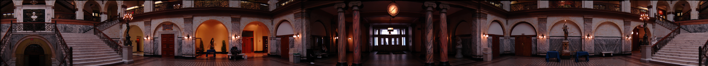
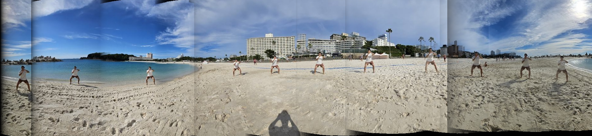

# Mosaicing

### Instructions Received

You can use the provided IPython notebook file with skeleton code using platforms like Jupyter or Google Colab. Please implement all steps from scratch using Numpy. Usage of external libraries such as OpenCV or similar is not allowed.

- No copying code from your classmates or internet sources.
- You can discuss ideas and approaches, but cannot share code. Try to implement it yourself. If you collaborate on ideas with classmates, please indicate who in your submission.
- No cheating, please! We check code similarity.
- Use your own camera and add your own pictures.

**Steps to follow:**

1. Take pictures using a tripod (or handheld).
2. Calibrate the camera (already coded; see the web for instructions).
3. Warp to cylindrical coordinates (derive and use inverse warping).
4. Automatically compute pair-wise alignments (pyramid-based iterative Lucas-Kanade).
5. Correct for drift (use global warp).
6. Blend the images together.
7. Crop the result and import into a viewer.
8. Make it robust and analyze what you did.

### How to Use

The code is designed to work out of the box by running two notebooks. The following steps will guide you through the process:

1. **Test Notebook**:
    - Open `CV_p2_Mosaicing_test_6930364431.ipynb` [link here](test/CV_p2_Mosaicing_test_6930364431.ipynb).
    - This notebook creates a panorama from the provided images and files.
    - Navigate to the `test` folder.
    - Run all cells sequentially from start to finish.
    - Look at the resulting `panorama_test.png`

2. **Final Notebook**:
    - Open `CV_p2_Mosaicing_final_6930364431.ipynb` [link here](final/CV_p2_Mosaicing_final_6930364431.ipynb).

    - This notebook creates a panorama from the images you took and the associated files.
    - Navigate to the `final` folder.
    - Run all cells sequentially from start to finish.
    - Look at the resulting `panorama.png`

**Folder Structure**:

- `utils`: Contains scripts used to rename images, reorder them, and resize them when necessary.
- `test`: Contains `CV_p2_Mosaicing_test_6930364431.ipynb` and all the necessary files in a zip file.
- `final`: Contains `CV_p2_Mosaicing_final_6930364431.ipynb` and all the necessary files in a zip file, organized in subfolders.

### Analysis

#### Test Project (Provided Images)

The test project using the images provided by the instructors works as expected. The final mosaic looks visually appealing, with all images well-placed and blended seamlessly. This demonstrates the effectiveness of the implemented steps in the notebook:

#### Final Project (Own Images)

The final notebook, which creates a panorama using images I took, successfully demonstrates the artistic effect of the "影分身の術" (Shadow Clone Technique) from the manga and anime "Naruto." This was the initial goal of the project. The technique involves creating multiple instances of the same person. This is effectively achieved in the final output:

However, there are several areas for improvement. Some of them include:

- **Transition Quality**: Some transitions between individual images look clunky and unnatural.
- **Visible Stitching Lines**: There are noticeable stitching lines where the images are joined.
- **Discontinuities**: Irregularities are present in the waterline, sand tracks, and building alignments.

**Possible Reasons for Issues**:

1. **Camera Limitations**: Using a smartphone camera resulted in size mismatches between different pictures. The calibration adjustments were not sufficient to correct these discrepancies.
2. **Insufficient Images**: More images might be needed to create a smoother panorama.
3. **Algorithm Robustness**: The Lucas-Kanade algorithm may not be robust enough for images lacking sharp edges.

**Future Work**:

Unfortunately, due to time constraints, I was unable to debug the code and make further improvements. Future work could focus on enhancing the robustness of the algorithm and refining the calibration and blending processes.
